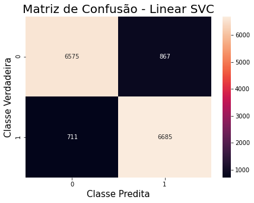

# Projeto de Classificação de Texto - IMDB (Pt-Br)

**LinkedIn**: https://linkedin.com/in/matheusjerico <br>
**Github**: https://github.com/matheusjerico

#### O que será feito?

- Ler o conjunto de dados que o Luís Fred forneceu na Plataforma do Kaggle (https://www.kaggle.com/luisfredgs/imdb-ptbr/)
- Transformar os textos das avaliação em valores numéricos usando Pipeline do Scikit-learn
- Criar um Classificador, treinar e realizar predições
- Testar o Classificador com novas avaliações
- Avaliar o desempenho do Classificador

#### Qual o objetivo?
Realizar a Análise de Sentimento do conjunto de Dados de Avaliações de filmes do IMDB, em português. Construir um Classificador com o objetivo de classificar se a avaliação foi **Positiva** ou **Negativa**.

## 1. Importar bibliotecas


```python
import numpy as np
import pandas as pd
from IPython.display import Markdown, display
from sklearn. feature_extraction.text import TfidfVectorizer
from sklearn.model_selection import train_test_split
from sklearn.pipeline import Pipeline
from sklearn.naive_bayes import MultinomialNB
from sklearn.svm import LinearSVC
from sklearn.ensemble import RandomForestClassifier
from sklearn.metrics import confusion_matrix, classification_report, accuracy_score
from nltk.corpus import stopwords
import matplotlib.pyplot as plt
import seaborn as sns
```

## 2. Carregar conjunto de dados

- unzip arquivo


```python
! unzip -n ../dataset/imdb-ptbr.zip  -d ../dataset
! ls ../dataset/
```

    Archive:  ../dataset/imdb-ptbr.zip
    imdb-ptbr.zip  imdb-reviews-pt-br.csv


- carregando conjutno de dados


```python
dataset = pd.read_csv("../dataset/imdb-reviews-pt-br.csv")
```


```python
dataset.drop(columns=['text_en', 'id'], inplace=True)
```

- primeiros registros do dataset


```python
dataset.head()
```


<div>
<table border="1" class="dataframe">
  <thead>
    <tr style="text-align: right;">
      <th></th>
      <th>text_pt</th>
      <th>sentiment</th>
    </tr>
  </thead>
  <tbody>
    <tr>
      <th>0</th>
      <td>Mais uma vez, o Sr. Costner arrumou um filme p...</td>
      <td>neg</td>
    </tr>
    <tr>
      <th>1</th>
      <td>Este é um exemplo do motivo pelo qual a maiori...</td>
      <td>neg</td>
    </tr>
    <tr>
      <th>2</th>
      <td>Primeiro de tudo eu odeio esses raps imbecis, ...</td>
      <td>neg</td>
    </tr>
    <tr>
      <th>3</th>
      <td>Nem mesmo os Beatles puderam escrever músicas ...</td>
      <td>neg</td>
    </tr>
    <tr>
      <th>4</th>
      <td>Filmes de fotos de latão não é uma palavra apr...</td>
      <td>neg</td>
    </tr>
  </tbody>
</table>
</div>


- últimos registros do dataset


```python
dataset.tail()
```


<div>
<table border="1" class="dataframe">
  <thead>
    <tr style="text-align: right;">
      <th></th>
      <th>text_pt</th>
      <th>sentiment</th>
    </tr>
  </thead>
  <tbody>
    <tr>
      <th>49454</th>
      <td>Como a média de votos era muito baixa, e o fat...</td>
      <td>pos</td>
    </tr>
    <tr>
      <th>49455</th>
      <td>O enredo teve algumas reviravoltas infelizes e...</td>
      <td>pos</td>
    </tr>
    <tr>
      <th>49456</th>
      <td>Estou espantado com a forma como este filme e ...</td>
      <td>pos</td>
    </tr>
    <tr>
      <th>49457</th>
      <td>A Christmas Together realmente veio antes do m...</td>
      <td>pos</td>
    </tr>
    <tr>
      <th>49458</th>
      <td>O drama romântico da classe trabalhadora do di...</td>
      <td>pos</td>
    </tr>
  </tbody>
</table>
</div>


- dimensão do dataset


```python
dataset.shape
```


    (49459, 2)


- Vamos visualizar um registro negativo:


```python
display(Markdown('> '+dataset['text_pt'][2]))
```


> Primeiro de tudo eu odeio esses raps imbecis, que não poderiam agir se tivessem uma arma pressionada contra suas testas. Tudo o que eles fazem é amaldiçoar e atirar um no outro e agir como uma versão clichê de gangsters. O filme não leva mais de cinco minutos para explicar o que está acontecendo antes que já estivessem no armazém. Não há um único personagem simpático nesse filme, com exceção do sem-teto, que também é o único com metade do cérebro. William Paxton e William Sadler são ambos "hill billies" e Sadler é tão vilão quanto os gângsteres. Eu não gostava dele desde o começo. O filme está cheio de violência sem sentido e especialidade de Walter Hills: pessoas caindo de janelas com vidros voando por toda parte. Não há praticamente nenhum enredo e é um grande problema quando você torce por ninguém. Todo mundo morre, exceto Paxton e o sem-teto e todos recebem o que merecem. Os dois únicos negros que podem atuar são o sem-teto e o viciado, mas são atores de profissão, não irritantes rappers feios. Fique longe dessa porcaria. e observe 48 horas 1 e 2 em vez disso. No mínimo, eles têm personagens de que você gosta, senso de humor e nada além de atores reais no elenco.


## 2. Análise Exploratória

### 2.1. Valores NaN


```python
dataset.isnull().sum()
```


    text_pt      0
    sentiment    0
    dtype: int64


### 2.2. Avaliações vazias?


```python
blk = []

for index, text, label in dataset.itertuples():
    if type(text) == str:
        if text.isspace():
            blk.append(i)

print(f"{len(blk)}, vazios: {blk}")
```

    0, vazios: []


### 2.3. Distribuição das avaliações


```python
dataset['sentiment'].value_counts()
```


    neg    24765
    pos    24694
    Name: sentiment, dtype: int64


- Dataset é balanceado.

## 3. Divisão dos Dados

- Colocando as avaliações em lower case


```python
dataset['text_pt'] = dataset['text_pt'].str.lower()
```

- dividindo os dados em treino e teste


```python
X = dataset['text_pt']
y = dataset['sentiment']

X_train, X_test, y_train, y_test = train_test_split(X, y, test_size = 0.3, random_state = 17)
```

## 4. Construindo Pipeline 
- 1º etapa: TD-IDF
- 2º etapa: Machine learning

### 4.1. Naive Bayes


```python
clf_nb = Pipeline([('TF-IDF', TfidfVectorizer(lowercase=True, stop_words=stopwords.words('portuguese'))),
                   ('Classificador', MultinomialNB()),
])
```

### 4.2. Linear SVC


```python
clf_svc = Pipeline([('TF-IDF', TfidfVectorizer(lowercase=True, stop_words=stopwords.words('portuguese'))),
                   ('Classificador', LinearSVC()),
])
```

### 4.3. Random Forest


```python
clf_rf = Pipeline([('TF-IDF', TfidfVectorizer(lowercase=True, stop_words=stopwords.words('portuguese'))),
                   ('Classificador', RandomForestClassifier()),
])
```

## 5. Treinamento, Predição e Avaliação - ML

### 5.1. Naive Bayes

- Treinamento


```python
clf_nb.fit(X_train, y_train)
```

- Predição


```python
preds = clf_nb.predict(X_test)
```

- Matriz de Confusão


```python
fig, ax = plt.subplots(figsize=(7, 5))
sns.heatmap(confusion_matrix(y_test, preds), annot=True, fmt="d");
ax.set_title("Matriz de Confusão - Naive Bayes", fontsize=20)
ax.set_ylabel('Classe Verdadeira', fontsize=15)
ax.set_xlabel('Classe Predita', fontsize=15)
```


    Text(0.5, 24.0, 'Classe Predita')


- Precisão, Revocação e F1-Score


```python
print(classification_report(y_test,preds))
```

                  precision    recall  f1-score   support
    
             neg       0.85      0.88      0.87      7442
             pos       0.87      0.85      0.86      7396
    
        accuracy                           0.86     14838
       macro avg       0.86      0.86      0.86     14838
    weighted avg       0.86      0.86      0.86     14838
    


- Acurácia


```python
print(accuracy_score(y_test,preds))
```

    0.8630543199892169


### 5.2. Linear SVC

- treinamento


```python
clf_svc.fit(X_train, y_train)
```

- predição


```python
preds = clf_svc.predict(X_test)
```

- matriz de confusão


```python
fig, ax = plt.subplots(figsize=(7, 5))
sns.heatmap(confusion_matrix(y_test, preds), annot=True, fmt="d");
ax.set_title("Matriz de Confusão - Linear SVC", fontsize=20)
ax.set_ylabel('Classe Verdadeira', fontsize=15)
ax.set_xlabel('Classe Predita', fontsize=15)
```


    Text(0.5, 24.0, 'Classe Predita')





- Precisão, Revocação e F1-Score


```python
print(classification_report(y_test,preds))
```

                  precision    recall  f1-score   support
    
             neg       0.90      0.88      0.89      7442
             pos       0.89      0.90      0.89      7396
    
        accuracy                           0.89     14838
       macro avg       0.89      0.89      0.89     14838
    weighted avg       0.89      0.89      0.89     14838
    


- acurácia


```python
print(accuracy_score(y_test,preds))
```

    0.8936514355034372


### 5.3. Random Forest

- treinamento


```python
clf_rf.fit(X_train, y_train)
```

- predição


```python
preds = clf_rf.predict(X_test)
```

- matriz de confusão


```python
fig, ax = plt.subplots(figsize=(7, 5))
sns.heatmap(confusion_matrix(y_test, preds), annot=True, fmt="d");
ax.set_title("Matriz de Confusão - Random Forest", fontsize=20)
ax.set_ylabel('Classe Verdadeira', fontsize=15)
ax.set_xlabel('Classe Predita', fontsize=15)
```


    Text(0.5, 24.0, 'Classe Predita')


- acurácia


```python
print(accuracy_score(y_test,preds))
```

    0.8484297075077504


## 6. Análise

O algorítmo que obteve o melhor desempenho foi o Linear SVC.
- Acurácia: 89%
- Revocação: 90%
- F1-Score: 89%

## 7. Predição de nova avaliação


```python
avaliacao_supernatural = "A série Supernatural é longa, mas é muito boa e emocionante. \
Você se apega aos personagens, sofre por eles.. É uma série cheia de altos e baixos."
```


```python
avaliacao_purge = "A série é chata, o enredo é péssimo, horrível, Não gostei da śerie"
```


```python
print(clf_svc.predict([avaliacao_supernatural]))
```

    ['pos']


```python
print(clf_svc.predict([avaliacao_purge]))
```

    ['neg']


## FIM
